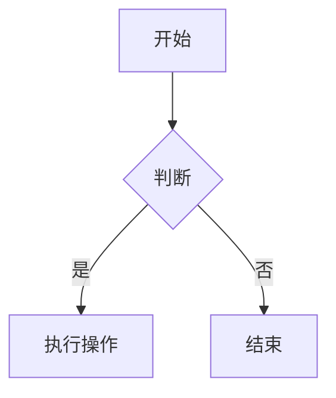

# Yes Markdown

<p align="center">
  
</p>

<p align="center">
  <a href="https://github.com/anthropics/claude-code">
    
  </a>
  
  
</p>

---

## 简介

Yes Markdown 是一款简洁优雅的跨平台 Markdown 编辑器，采用现代化的三栏布局设计，专注于提供流畅的写作体验。

### 为什么创建这个项目？

在日常工作和学习中，Markdown 已成为最受欢迎的轻量级标记语言。然而，许多现有的 Markdown 编辑器要么功能过于简单，要么过于臃肿。我们希望创建一款：

- **轻量级**：无需繁琐的配置，打开即用
- **功能完整**：支持代码高亮、数学公式、图表绘制
- **界面美观**：现代化的 UI 设计，支持明暗主题
- **跨平台**：基于 Tauri，一套代码支持 Windows、macOS、Linux

---

## 特性

### 核心功能

| 功能 | 说明 |
|------|------|
| 三栏布局 | 左侧文件树 / 中间编辑器 / 右侧实时预览 |
| 实时预览 | 输入即渲染，所见即所得 |
| 文件夹管理 | 支持创建文件夹，嵌套整理笔记 |
| 拖拽排序 | 自由调整笔记和文件夹的顺序 |
| 数据持久化 | 自动保存到本地存储 |

### 编辑功能

| 功能 | 说明 |
|------|------|
| 语法高亮 | 支持 Markdown 语法高亮 |
| 代码高亮 | 支持 JavaScript、Python、HTML、CSS、JSON 等 20+ 语言 |
| 工具栏 | 快捷插入粗体、斜体、代码、标题、列表等 |
| 快捷键 | 支持 Ctrl+B (粗体)、Ctrl+I (斜体) |

### 预览增强

| 功能 | 说明 |
|------|------|
| 代码高亮 | 语法高亮 + 语言标签 + 一键复制 |
| 数学公式 | KaTeX 支持 LaTeX 语法 |
| 图表支持 | Mermaid 支持流程图、时序图、甘特图等 |
| 表格渲染 | 自动渲染 Markdown 表格 |

### 组织与管理

| 功能 | 说明 |
|------|------|
| 标签系统 | 为笔记添加颜色标签 |
| 标签筛选 | 按标签查看相关笔记 |
| 多语言 | 支持中文、英语、德语 |
| 主题切换 | 明色/暗色主题 |

---

## 界面预览

### 主界面

```
┌────┬─────────────┬────────────────┬────────────────┐
│ 📁 │ 📝 笔记名称 │ # 标题        │ Preview        │
│    │             │ **粗体**      │                │
│ 📂 │ [工具栏]    │ 链接          │ 实时预览       │
│    │             │ `代码`        │                │
│ 📄 │             │               │                │
└────┴─────────────┴────────────────┴────────────────┘
  活   侧边栏        编辑器          预览
  动
  栏
```

### 主题展示

应用支持明色和暗色主题，适配您的使用环境和个人偏好。

---

## 快速开始

### 环境要求

- Node.js 18.x 或更高版本
- Rust (Tauri 构建需要)
- npm 或 pnpm 包管理器

### 安装

```bash
# 克隆项目
git clone https://github.com/your-username/yes-markdown-app.git
cd yes-markdown-app

# 安装依赖
npm install

# 启动开发模式
npm run tauri dev
```

首次运行会编译 Tauri 应用程序，可能需要几分钟时间。

### 构建生产版本

```bash
npm run tauri build
```

构建完成后，安装包位于 `src-tauri/target/release/bundle` 目录下。

---

## 使用指南

### 创建笔记

1. 点击侧边栏的「新建笔记」按钮
2. 在编辑器中输入标题和内容
3. 笔记会自动保存

### 创建文件夹

1. 点击侧边栏的「文件夹」按钮
2. 输入文件夹名称
3. 将笔记拖拽到文件夹中，或在文件夹中点击「+」添加新笔记

### 使用标签

1. 右键点击笔记，选择标签
2. 或在设置中管理标签（创建、编辑、删除、设置颜色）
3. 点击活动栏的「标签」图标，按标签筛选笔记

### 快捷键

| 快捷键 | 功能 |
|--------|------|
| Ctrl + B | 粗体 |
| Ctrl + I | 斜体 |
| Ctrl + Z | 撤销 |
| Ctrl + Y | 重做 |

### 代码块

使用三个反引号创建代码块，并指定语言：

<pre>
```javascript
function hello() {
  console.log("Hello, World!");
}
```
</pre>

### 数学公式

使用 `$...$` 表示行内公式，`$$...$$` 表示独立公式：

<pre>
行内公式: $E = mc^2$

独立公式:
$$
\int_{-\infty}^{\infty} e^{-x^2} dx = \sqrt{\pi}
$$
</pre>

### 图表

使用 mermaid 代码块创建图表：

<pre>

</pre>

---

## 技术栈

| 层级 | 技术 |
|------|------|
| 桌面框架 | Tauri 2.x |
| 前端框架 | Vue 3 + TypeScript |
| 构建工具 | Vite |
| 状态管理 | Pinia |
| 编辑器 | CodeMirror 6 |
| Markdown | markdown-it + highlight.js |
| 数学公式 | KaTeX |
| 图表 | Mermaid |

---

## 项目结构

```
yes-markdown-app/
├── src/                      # 前端源码
│   ├── main.ts               # 应用入口
│   ├── App.vue               # 主组件
│   ├── assets/
│   │   └── main.css          # 全局样式
│   ├── components/
│   │   ├── layout/           # 布局组件
│   │   │   ├── Sidebar.vue   # 侧边栏
│   │   │   ├── Editor.vue    # 编辑器
│   │   │   └── Preview.vue   # 预览
│   │   └── notes/            # 笔记组件
│   │       ├── NoteTree.vue  # 文件树
│   │       ├── TagSidebar.vue
│   │       └── TagManager.vue
│   ├── stores/               # 状态管理
│   │   ├── notes.ts
│   │   ├── theme.ts
│   │   └── i18n.ts
│   ├── utils/                # 工具函数
│   │   ├── markdown.ts
│   │   └── export.ts
│   └── types/
│       └── index.ts
├── src-tauri/                # Tauri 后端
│   ├── src/
│   │   └── main.rs
│   ├── Cargo.toml
│   ├── tauri.conf.json
│   └── icons/                # 应用图标
├── public/
├── CLAUDE.md                 # 开发指南
├── README.md
└── package.json
```

---

## 常见问题

### 数据存储在哪里？

数据存储在浏览器的 localStorage 中，键名为 `yes-markdown-data`。

### 支持导出吗？

支持将笔记导出为 Markdown (.md)、HTML (.html) 格式，以及将文件夹导出为 ZIP 包。

### 如何反馈问题？

请在 GitHub 仓库中提交 Issue，我们会尽快处理。

---

## 许可证

MIT License - 查看 [LICENSE](LICENSE) 了解详情。

---

## 致谢

- [Tauri](https://tauri.app/) - 跨平台应用框架
- [Vue](https://vuejs.org/) - 渐进式前端框架
- [CodeMirror](https://codemirror.net/) - 在线编辑器
- [markdown-it](https://github.com/markdown-it/markdown-it) - Markdown 解析器
- [KaTeX](https://katex.org/) - 数学公式渲染
- [Mermaid](https://mermaid.js.org/) - 图表绘制
